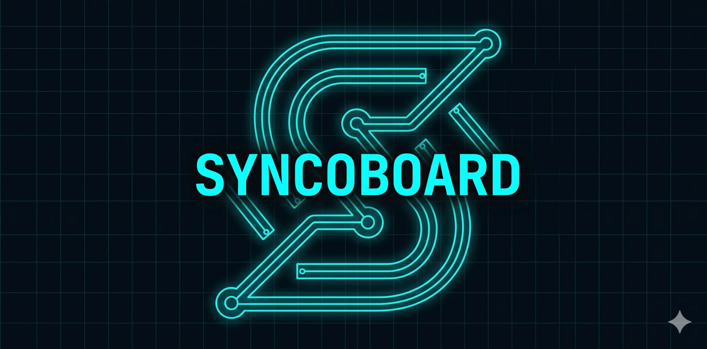

# Syncopate

## About

Syncopate is a powerful, unified productivity application and toolset built specifically for developers and power users. Designed with a strict terminal-inspired dark mode aesthetic, it provides a seamless workflow by combining a lightning-fast web interface with a robust, standard REST API backend.

**Why use Syncopate?**

- **Developer-Centric Experience**: Syncopate is built to feel like a natural extension of your workflow. Its terminal-inspired, distraction-free environment brings the joy back into task management, making staying organized an effortless and genuinely fun part of your day.
- **Focus on Building, Not Managing**: Say goodbye to context switching and clunky project management tools. Syncopate minimizes friction, bestowing your team with the pure focus needed to implement tasks and write code, rather than endlessly organizing boards.
- **Seamless CLI Integration**: Manage your workload without ever leaving your terminal. With an API built for integration and a seamless CLI experience, Syncopate keeps you in the zone.
