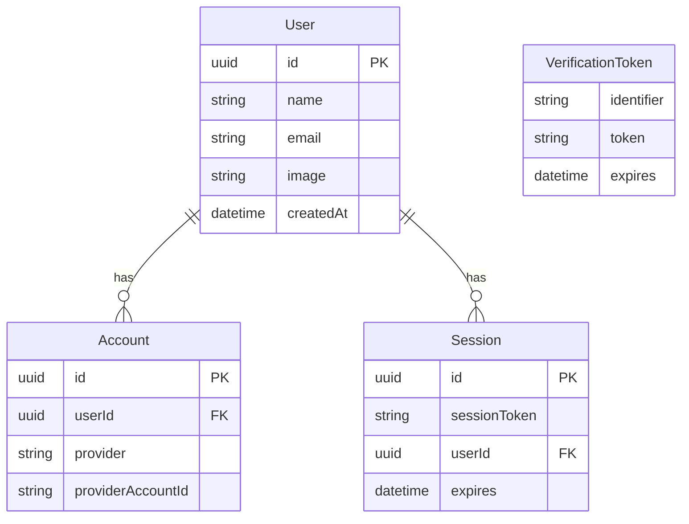
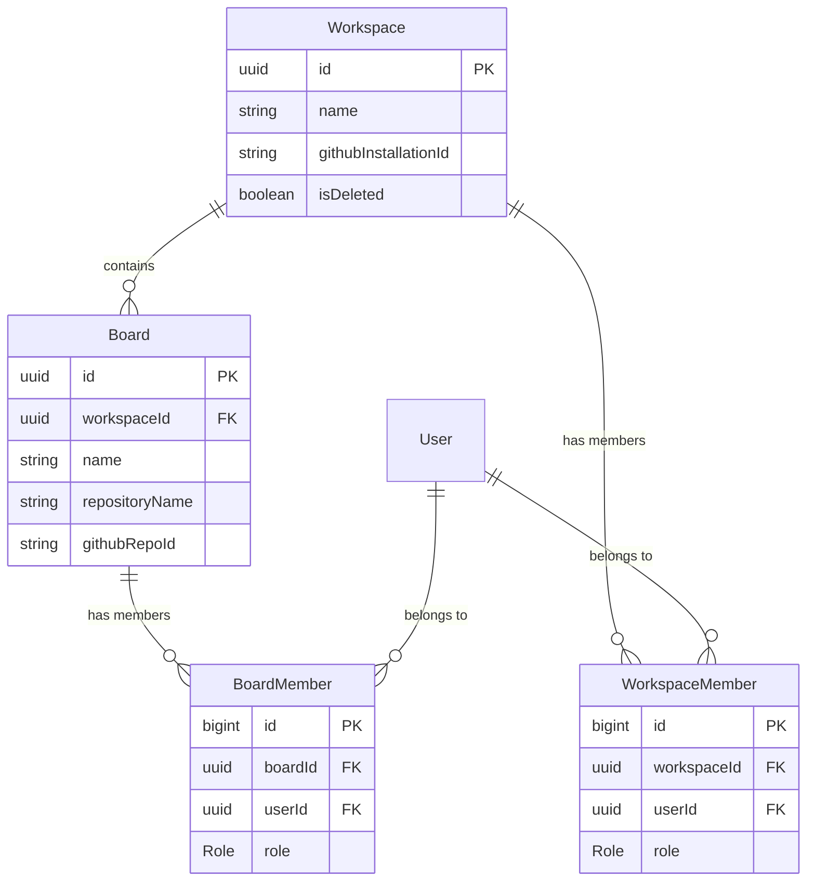
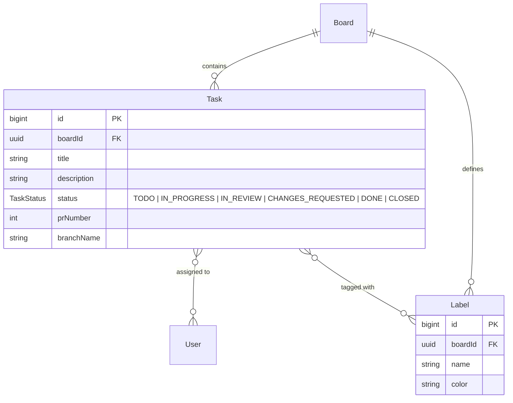
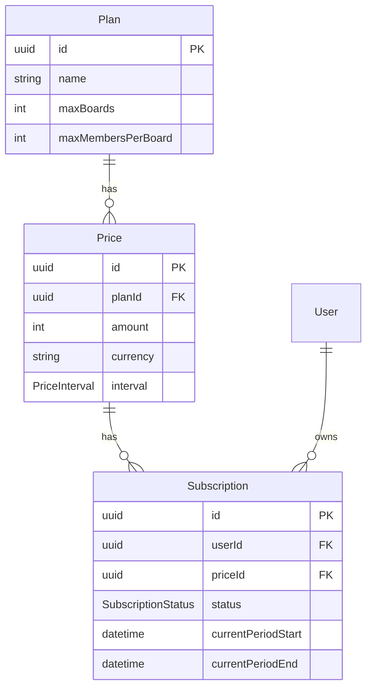

# Entity Relationship Diagrams (ERD)

This document provides a high-level overview of the database schema for the Syncoboard application. The schema is defined using Prisma and can be logically divided into four main domains: Authentication, Workspaces & Boards, Tasks & Labels, and Billing & Subscriptions.

## 1. Authentication

This domain handles user identities, OAuth accounts, and sessions. It strictly follows the Auth.js (NextAuth) standard database pattern for seamless authentication integration.

## 2. Workspaces & Boards

Workspaces form the top-level grouping, which contain multiple Boards. A Board combines the concepts of a Kanban board and a connected GitHub repository. Users can be invited as members to both Workspaces and Boards with specific roles (`ADMIN` or `MEMBER`).

## 3. Tasks & Labels

Tasks represent the work items within a Board. A Task aligns with a GitHub Pull Request and follows a hardcoded Kanban status (`TODO`, `IN_PROGRESS`, `IN_REVIEW`, `CHANGES_REQUESTED`, `DONE`). Tasks can be assigned to multiple Users and tagged with Labels.

## 4. Billing & Subscriptions

This domain manages plans, pricing, and user subscriptions. A `Plan` defines the limits (like max boards and members), while a `Price` defines the cost and interval. A user can have one active `Subscription` at a time.

